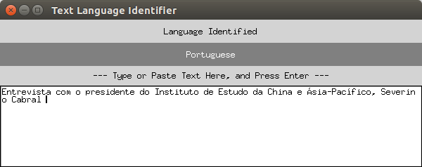

# Text Language Identifier

Author: Lei Mao

Date: 1/12/2018

## Introduction

This is a text language identifier using multi-class logistic regression algorithm based on n-gram features. It could classify 56 different languages of text with an accuracy of 75%. Although the accuracy is only 75% for the test datasest, in reality, it worked extremely well.

## Dependencies

* Python 3.6
* Numpy
* Scikit-Learn
* Io
* Json
* Pickle
* Time
* Tkinter

## Usage

To run the Text Language Identifier in GUI, simply run:

```shell
python text_language_identifier_gui.py
```

Type or copy the language in the blank block, and hit Enter.

## Demo



## Issues

Multi-Layer Perceptron and Naive Bayes does not perform significantly better than logistic regression. 

The model could not be improved better probably due to the quality of training data is low. For example, in the training dataset, "advertisement addressed to members of the House of Representatives ." is labeled as "ru"; "\u2022 Florida \u2022" is labeled as "da" (\u2022 is •). These two examples are found in the first twenty training data in the dataset. 

With training data of better quality, I  would expect the performance of the model could be around 85% - 90% with only logistic regression.

## Notes

The training of the model was not optimized to use stochastic gradient descent. The training may consume 5 - 8 GB RAM and take around 30 - 60 minutes to train using 12 cores of CPU.

## To-Do List

* ~~Map the language label to true language name in English. For example, in the training data, label "ru" should really be "russian".~~
* ~~Make a graphical user interface using Tkinter that allows user to paste the utf-8 format text to the model and do the classification.~~
* Implement a LSTM-RNN model for fun.